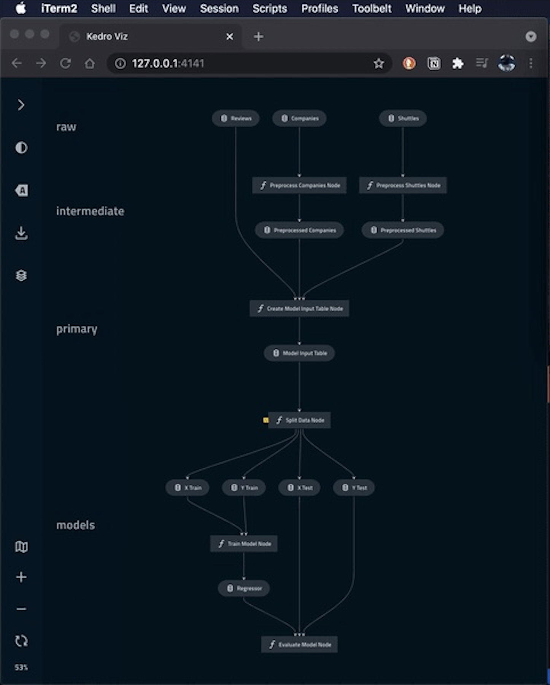

## Churn Prediction with Kedro, Kedro-Viz, and Kedro-Mlflow :snowflake: :man:

This repo is aimed at exploring Kedro, Kedro-viz and Kedro-mlflow for ML pipelines. For this project I have chosen a simple usecase of churn prediction. This project has four pipelines that are data preprocessing, data science, reporting and api. (:link: [Kedro](https://kedro.org/)) <br/>


## Table of Contents
  * [Customer Churn Prediction](#customer-churn-prediction)
  * [Kedro Visualization](#kedro-visualization)
  * [Setup](#setup)
  * [Todos](#todos)
  * [Acknowledgements](#acknowledgements)
  * [Citation](#citation)
  * [Connect with me](#connect-with-me)


# Customer Churn Prediction

Customer churn is the percentage of customers your business lost in a set period of time. For instance, if you had 100 customers at the beginning of the month, and lost 
10 of them throughout the month, you had a 10% churn rate for the month.

In this project, I have addressed the problem of churning of customers. I have aggregated data of a Telecommunication company and applied EDA on the data. After 
understanding the data, I have applied many classification models on it like decision tree classifier, random forest, xgboost, logistic regression, LGBM, SVM, 
adaboost, neurel network, Naive Bayes and random forest after PCA.

The results were:


After that I made a Flask api which takes all the parameters and returns the result back. I deployed the project on Heroku.

I have also made a Power BI report to better understand and visualize the data.


## Kedro Visualization

<p align="center">

</p>

## Setup

So we talked about what customer churn prediction is, and what it can do for us (among other things). <br/>
Let's get this thing running! Follow the next steps:

1. `git clone https://github.com/abideenml/Kedro-ML-pipeline`
2. Navigate into project directory `cd path_to_repo`
3. Create a new venv environment and run `pip install -r requirements.txt`
4. Run your Kedro project with:

```
kedro run
```
5. You can run your tests mentioned below. To configure the coverage threshold, go to the `.coveragerc` file.

```
kedro test
```
  
6. To generate or update the dependency requirements for your project:

```
kedro build-reqs
```
7. To launch Kedro-Viz from the command line as a Kedro plugin, use the following command from the root folder of your Kedro project:

```bash
kedro viz
```

A browser tab opens automatically to serve the visualisation at `http://127.0.0.1:4141/`.

That's it! It should work out-of-the-box executing requirements.txt file which deals with dependencies. <br/>

## Todos:

Finally there are a couple more todos which I'll hopefully add really soon:
* Deploy this entire pipeline on AWS Ec2.
* Capture drift and validate data.
* Perform extensive feature engineering and data exploration to better understand the missing points of data story.


## Acknowledgements

I found these resources useful (while developing this one):

* [Building and Managing Data Science Pipelines with Kedro](https://neptune.ai/blog/data-science-pipelines-with-kedro)
* [Kedro-Mlflow](https://github.com/Galileo-Galilei/kedro-mlflow)
* [Data Versioning with DVC](https://medium.com/@thanakornpanyapiang/data-versioning-with-dvc-a474af1247f5)


## Citation

If you find this code useful, please cite the following:

```
@misc{Zain2023KedroMLPipeline,
  author = {Zain, Abideen},
  title = {kedro-ml-pipeline},
  year = {2023},
  publisher = {GitHub},
  journal = {GitHub repository},
  howpublished = {\url{https://github.com/abideenml/Kedro-ML-pipeline/tree/master/Detecting-Telephone-based-Social-Engineering-Attacks}},
}
```

## Connect with me

If you'd love to have some more AI-related content in your life :nerd_face:, consider:

* Connect and reach me on [LinkedIn](https://www.linkedin.com/in/zaiinulabideen/) and [Twitter](https://twitter.com/zaynismm)
* Follow me on 📚 [Medium](https://medium.com/@zaiinn440)
* Subscribe to my 📢 weekly [AI newsletter](https://rethinkai.substack.com/)!

## Licence

[](https://github.com/abideenml/Kedro-ML-pipeline/blob/master/LICENCE)